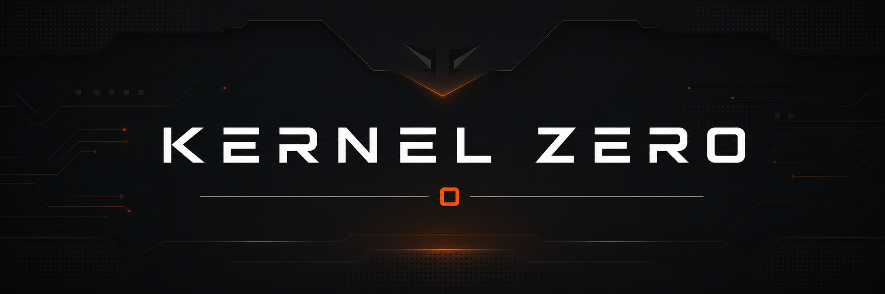

<p align="center">
  
</p>

<p align="center">
  <a href="https://github.com/AP3X-Dev/KERNEL-ZERO/actions/workflows/kernel-zero.yml"></a>
  <a href="LICENSE"></a>
  
</p>

# KERNEL ZERO

KERNEL ZERO is a policy-first governance kernel and control plane. Architectural
rules stop being folklore in a wiki and become a versioned artifact that a
deterministic checker enforces on every commit, with a tamper-evident record of
what it found.

Its first profile governs software architecture through versioned policy,
deterministic repository validation, maker-checker decisions, controlled
exceptions, and tamper-evident verification records.

The repository is a single TypeScript monorepo. Shared identity, tenancy,
authorization, policy, exception, audit, and evidence primitives live beside the
control application and deterministic validator. Additional profiles reuse those
primitives without creating separate products or control planes.

## How it works

1. **Policy** is a JSON document, not code. It declares rules such as "nothing
   under `apps/**` may import the persistence package". It cannot execute.
2. **The validator** is a network-free CLI over the TypeScript compiler API. It
   reads the policy and the repository and writes **evidence**: normalized
   findings, never source. Exit 0 passes, 1 has findings, 2 could not complete.
3. **The control plane** stores policies and their revisions, requires a second
   approver, ingests evidence runs, and grants exceptions that expire. Every
   record is fingerprinted, so an altered one stops verifying.
4. **The gate** is CI. A local hook gives fast feedback; the protected branch
   check is what actually blocks a merge.

## Local start

Requirements: Node 22 and npm 10 or newer. PostgreSQL is needed to run the
control application; the test suites start their own database.

```text
npm ci
npm run prisma:generate
npx prisma migrate deploy --schema packages/persistence/prisma/schema.prisma
npm run dev
```

Copy `.env.example` to `.env` and replace every local-only value before using a
shared environment. The application is served at `http://127.0.0.1:3000` by
default.

## Deterministic enforcement

```text
npm run validator:self       # this repository against its own policy
npm run validator:workflow   # workflow hygiene profile
npm run verify               # the full gate; exit 0 is the only pass
```

The validator writes `.kernel-zero/evidence.json`. Two runs over an unchanged
tree produce the same integrity digest, because run identity and timing are
excluded from it. The validator never uploads repository source.

## Adopting it in another repository

The validator ships as a self-contained bundle, so a consumer needs no access to
this monorepo.

```text
npm install --save-dev @kernel-zero/validator
```

Then add a `validator:self` script, copy `.githooks/pre-commit`, and copy the CI
workflow. `docs/validator-and-hooks.md` carries the exact commands and the two
custody items a human owns: making the check required, and protecting the
workflow, policy, and validator from the contributors being judged. Maintainers
can run `npm run validator:package:check` to build, pack, install, and exercise
the exact consumer artifact before a release.

## Profiles

The kernel parses only policy and evidence envelopes. A profile owns the full
policy schema, the evidence schema, finding compatibility, and rule diffing, and
is registered at build time in `packages/profiles`. Profiles never load at
runtime and the control plane never executes them against user input.

| Policy kind        | Evidence kind        | Tool                    | Governs                             | Package                                  |
| ------------------ | -------------------- | ----------------------- | ----------------------------------- | ---------------------------------------- |
| `RepositoryPolicy` | `RepositoryEvidence` | `kernel-zero-validator` | TypeScript imports, calls, exports  | `packages/profile-software-architecture` |
| `ManifestPolicy`   | `ManifestEvidence`   | `kernel-zero-manifest`  | Licenses and pinned dependencies    | `packages/profile-manifest`              |
| `WorkflowPolicy`   | `WorkflowEvidence`   | `kernel-zero-workflow`  | GitHub Actions pinning, permissions | `packages/profile-workflow`              |

To add a profile: create `packages/profile-<name>` exporting a `Profile`, add it
to `PROFILES`, and allow it in `scripts/check-architecture.mjs`. Kernel packages
may not import it; the self-policy rule `kernel-does-not-import-profiles`
enforces that. Adding one must leave `packages/domain`, `packages/contracts`, and
`packages/persistence` untouched.

## Project boundaries

- The web application is a control plane; it does not execute repository code.
- Local validation is deterministic and network-free.
- Definite policy violations fail closed. Optional external context must not be
  treated as the policy authority.
- Local hooks improve feedback; protected CI is the merge gate.
- External publication, pull-request creation, merge, deployment, and production
  credential use require separate human approval.

## Engineering skills

Project skills live in `.claude/skills`: `kz-grill` (design interview, run
first), `kz-governed-action`, `kz-policy-rule`, `kz-profile`, `kz-adopt`. After
`kz-governed-action`, `kz-policy-rule`, or `kz-profile` reports done, run the
`kz-checker` agent in `.claude/agents`. Engineering rules for the repository are
in `CLAUDE.md`; design decisions are recorded in `docs/adr`.

## License

KERNEL ZERO is available under the [MIT License](LICENSE).
